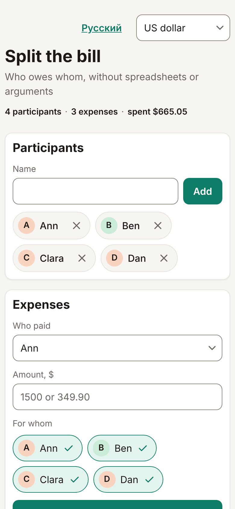

# Делим счёт

Веб-приложение для тех, кто ездит компанией или ходит в кафе: вносите траты, а приложение считает, кто кому сколько должен, и сводит расчёты к минимальному числу переводов. Удобно открывать и с телефона, и с компьютера.



## Возможности

- Участники: добавляйте и удаляйте людей из компании.
- Траты: кто платил, сколько и за кого — за всех или только за часть компании.
- Итог: минимальное число переводов и объяснение, как посчитано (кто сколько заплатил и какая у него доля).
- Ссылка «Поделиться» — без сервера и регистрации: счёт хранится во фрагменте адреса после `#`, и сервер его не получает.

## Как запустить локально

Нужен Node 22 или новее.

```sh
npm ci            # установить зависимости
npm run dev       # dev-сервер на http://localhost:5173/ — откройте адрес в браузере
make check        # проверки: форматирование, типы, линтер, тесты, сборка
npm run build     # сборка в каталог dist
npm run preview   # посмотреть собранное приложение
npm run format    # отформатировать код
```

## Как устроен проект

- `src/bill` — счёт: участники, траты, суммы в копейках.
- `src/settlement` — расчёт: балансы, доли и сведение долгов к минимальному числу переводов.
- `src/sharing` — кодирование счёта в ссылку и разбор ссылки.
- `src/ui` — интерфейс: секции страницы и работа с DOM.
- `src/style.css` — стили, в том числе мобильная вёрстка.
- `index.html` — единственная страница, в неё подключается `src/main.ts`.
- `.github/workflows` — выкладка на GitHub Pages.

Предметная логика (`src/bill`, `src/settlement`, `src/sharing`) не знает о DOM: это закрепляет ESLint.

## Выкладка на GitHub Pages

Сайт выкладывается из ветки `main` workflow «Выкладка на GitHub Pages».

1. В репозитории откройте Settings → Pages → Build and deployment и выберите Source: «GitHub Actions».
2. Сделайте push в `main` или откройте Actions → «Выкладка на GitHub Pages» → Run workflow (ветка `main`: окружение `github-pages` по умолчанию разрешает выкладку только из ветки по умолчанию).

Адрес сайта — `https://<владелец>.github.io/split-bill/`. Он появится в Settings → Pages и в сводке запуска у job «Выкладка».

## Ограничения

- Очень большой счёт (сотни участников или тысячи трат) может не поместиться в ссылку и откроется как повреждённый.
- Точный минимум переводов гарантирован до 16 участников с ненулевым балансом, дальше расчёт приближённый, и приложение об этом пишет.
