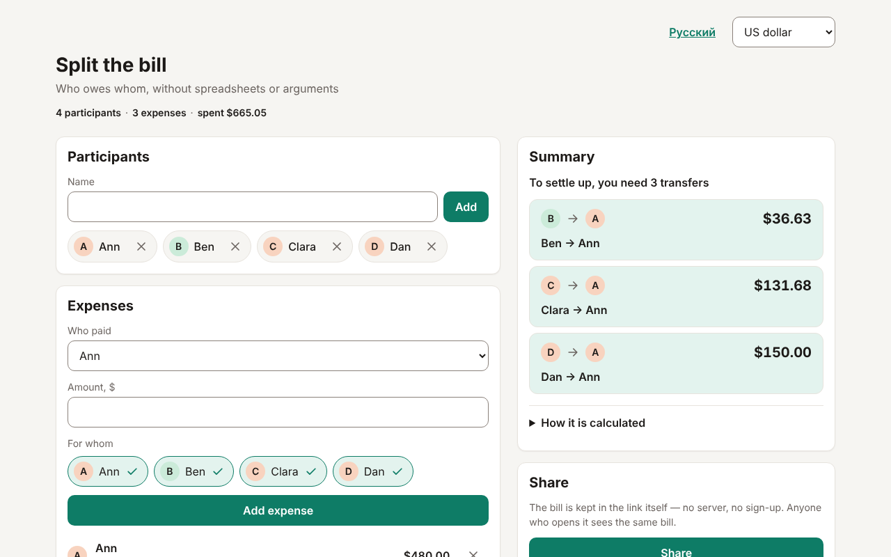
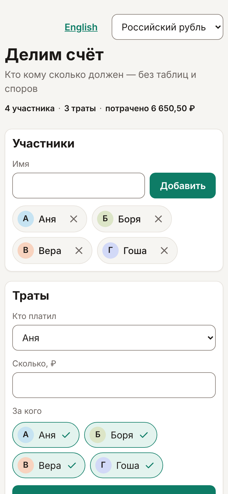
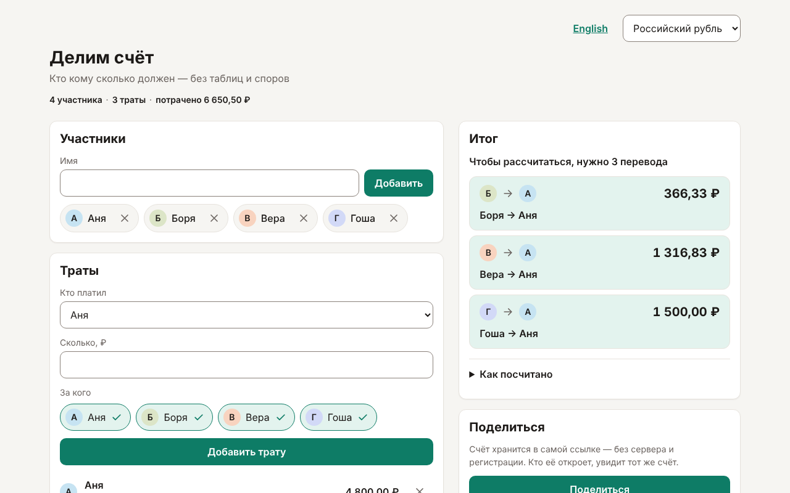

# Split the bill (Делим счёт)

A web app for people who travel in a group or go to a cafe together: enter the expenses, and the app calculates who owes whom and how much, and reduces the settlements to the minimal number of transfers. It is convenient to open on both a phone and a computer.

The interface is in English and in Russian, and a bill is kept in US dollars or Russian rubles:

- English: `https://bysavelii.github.io/split-bill/`
- Russian: `https://bysavelii.github.io/split-bill/ru/`




The Russian version, «Делим счёт»:





## Features

- Participants: add and remove people from the group.
- Expenses: who paid, how much and for whom: for everyone or only for part of the group.
- Summary: the minimal number of transfers and an explanation of how it was calculated (who paid how much and what their share is).
- Two languages and two currencies: English (dollars by default) at `/split-bill/` and Russian (rubles by default) at `/split-bill/ru/`. The language link and the currency select are in the header; the currency is only a label of the bill, there is no conversion between currencies.
- Light and dark themes follow the system setting; on a wide screen there are two columns: participants and expenses on the left, the summary on the right.
- The "Share" link needs no server or registration: the bill and its currency are stored in the address fragment after `#`, and the server never receives them. The language link carries the bill along too, so switching the language keeps it. Links made by older versions of the app (without a currency) still open.
- Both pages are indexable: the `<head>` has the title, description, canonical and `hreflang` links, Open Graph and Twitter tags and structured data; the site has a sitemap, `robots.txt` and a preview image per language; the title, the subtitle and the "How it works" section are in the page without scripts.

## Lighthouse

Reports for the mobile profile (Lighthouse 13): [English](docs/lighthouse/en.report.html) and [Russian](docs/lighthouse/ru.report.html). Both pages score 100 for Performance, Accessibility, Best Practices and SEO. Download a report and open it in a browser. How to repeat the measurement is in AGENTS.md, section "How to check the look".

## Running locally

Node 22.12 or newer is required. The site is built with [Astro](https://astro.build/); the interface is a single [Solid](https://www.solidjs.com/) island.

```sh
npm ci            # install dependencies
npm run dev       # dev server at http://localhost:4321/split-bill/ — open the address in a browser
make check        # checks: formatting, types (astro check), linter, tests, build
npm run build     # build the static site into the dist directory
npm run preview   # look at the built app at http://localhost:4321/split-bill/
npm run format    # format the code
```

## Project structure

- `src/bill` — the bill: participants, expenses, amounts in minor units (cents, kopecks), the list of currencies.
- `src/settlement` — the calculation: balances, shares and reducing debts to the minimal number of transfers.
- `src/sharing` — encoding the bill and its currency into a link and parsing the link.
- `src/i18n` — the languages: the dictionaries of interface texts (`en.ts`, `ru.ts`), the language definitions and number, money and plural formatting through `Intl`.
- `src/seo` — page metadata (title, canonical, `hreflang`, Open Graph, structured data) and `robots.txt`.
- `src/ui` — the interface: Solid components (`*.tsx`) for the page sections, the header controls and their plain TypeScript helpers.
- `src/components` — static Astro markup around the island: the `<head>` of the page and the "How it works" section.
- `src/pages/[...locale].astro` — the page, built once per language: English at the root, Russian under `ru/`; it renders the `App` island (`<App client:load locale={locale} />`).
- `src/style.css` — styles: tokens (colors of both themes, spacing, radii) and the layout for phone and computer; the rules are in AGENTS.md, section "Interface style".
- `public` — the favicon and the preview images `og-image-en.png` and `og-image-ru.png`.
- `docs` — screenshots and Lighthouse reports.
- `.github/workflows` — checks on pull requests and deployment to GitHub Pages.

Code without the DOM (`src/bill`, `src/settlement`, `src/sharing`, `src/i18n`, `src/seo`) knows nothing about the DOM, Solid and Astro: ESLint enforces this. How to add a text, a language or a currency is in AGENTS.md, section "Texts, languages and currencies".

## Deploying to GitHub Pages

The site is deployed from the `main` branch by the workflow "Deploy to GitHub Pages". The workflow "Checks" runs `make check` on every pull request into `main`.

1. In the repository open Settings → Pages → Build and deployment and choose Source: "GitHub Actions".
2. Push to `main` or open Actions → "Deploy to GitHub Pages" → Run workflow (branch `main`: the `github-pages` environment by default allows deployment only from the default branch).

`astro build` puts the site into `dist` with the base path `/split-bill/`, and the workflow publishes that directory. The site address is `https://<owner>.github.io/split-bill/` (Russian under `ru/`); the canonical addresses and the sitemap are built from `site` in `astro.config.js`, which holds the address of the project's own deployment: change it for a fork. The address appears in Settings → Pages and in the run summary of the "Deploy" job.

## Limitations

- The amount field is the same on both pages: a point or a comma is the decimal separator, spaces are ignored, other thousands separators (`1,250.50`) are rejected.
- A very large bill (hundreds of participants or thousands of expenses) may not fit into a link and will open as corrupted.
- The exact minimum number of transfers is guaranteed for up to 16 participants with a non-zero balance; beyond that the calculation is approximate, and the app says so.
